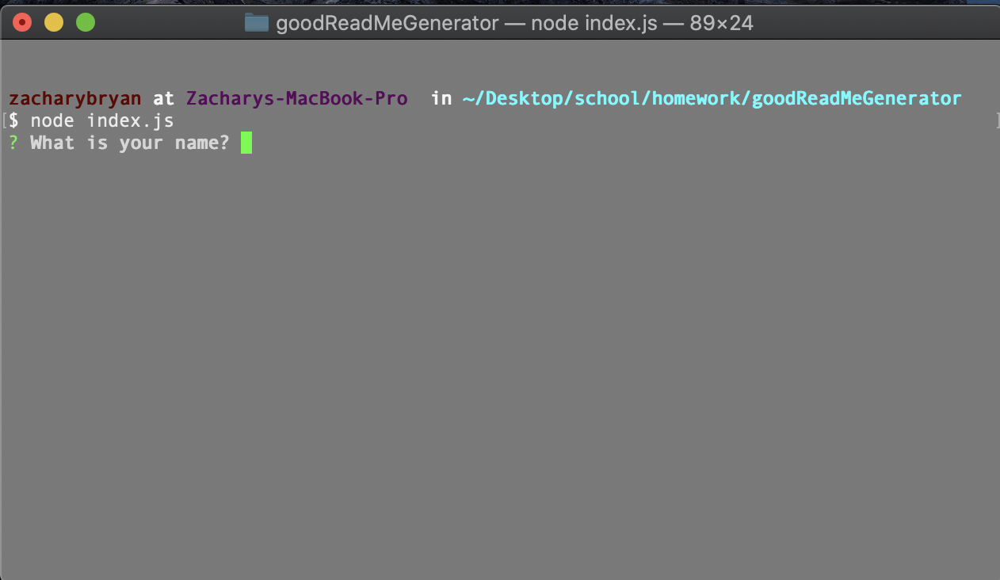
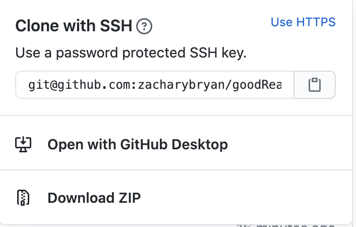

# Good README Generator

[Github link](wwww.github.com/zacharybryan/goodReadMeGenerator)

---

## Description

This project is a README generator designed to run in a command terminal compatible with node. It offers a variety of standard readme sections, the option to input a link to the deployed project and input file paths to add a screenshot. It's created in JavaScript, with Inquirer dependancy. 

---
### Table of Contents

* [Description](#description)
* [Installation](#installation)
* [Usage](#usage)
* [Contributing](#contributing)
* [Tests](#tests)
* [Questions](#questions)
* [License](#licence)

---
### Installation

[Watch the demo here!](wwww.youtube.com)

* Create a clone of the repository

* Run npm i to install  dependencies (Inquirer)
* Run node index.js to start the generator.

---
### Usage

[Watch the demo here!](wwww.youtube.com)
1. User will be prompted a series of question about the project and themselves.
1. The README.md file will be created and named READMEcomputed.md
1. Add a licence file to correspond with the users choice.

---
### Contributing

- [Plover Brown](https://github.com/rebgrasshopper)
- [Kira Bismuth Lowrey](https://github.com/KILowrey)
- [Nancy Lambert-Brown](https://github.com/n-lambert)
- [Mando Estrada](https://github.com/Mando619)
- [Perry Theobald](https://github.com/perrytjr)
- [Jeneth Diestra](https://github.com/jen6one9)
- [Matthew Rogers](https://github.com/Rogers-Development-Services)
- [Jefrrey Choi](https://github.com/jepoy92)
- [Clyde Baron Rapinan](https://github.com/clydebaron2000)
- [Johnny Lieu](https://github.com/johnnylieu)
- [Robert Graham](https://github.com/Robmgraham)

---
### Tests

* Run the program a second time and try a different licence

---
### Questions

For any additional questions or update requests please contact me at zacharybryan@icloud.com

Find some of my other projects here!
[zacharybryan](https://www.github.com/zacharybryan)

---
### License

*MIT License*

Permission is hereby granted, free of charge, to any person obtaining a copy of this software and associated documentation files (the "Software"), to deal in the Software without restriction, including without limitation the rights to use, copy, modify, merge, publish, distribute, sublicense, and/or sell copies of the Software, and to permit persons to whom the Software is furnished to do so, subject to the following conditions:

The above copyright notice and this permission notice shall be included in all copies or substantial portions of the Software.

THE SOFTWARE IS PROVIDED "AS IS", WITHOUT WARRANTY OF ANY KIND, EXPRESS OR IMPLIED, INCLUDING BUT NOT LIMITED TO THE WARRANTIES OF MERCHANTABILITY, FITNESS FOR A PARTICULAR PURPOSE AND NONINFRINGEMENT. IN NO EVENT SHALL THE AUTHORS OR COPYRIGHT HOLDERS BE LIABLE FOR ANY CLAIM, DAMAGES OR OTHER LIABILITY, WHETHER IN AN ACTION OF CONTRACT, TORT OR OTHERWISE, ARISING FROM, OUT OF OR IN CONNECTION WITH THE SOFTWARE OR THE USE OR OTHER DEALINGS IN THE SOFTWARE.
---
Copyright (c) 2020 Zachary Bryan
